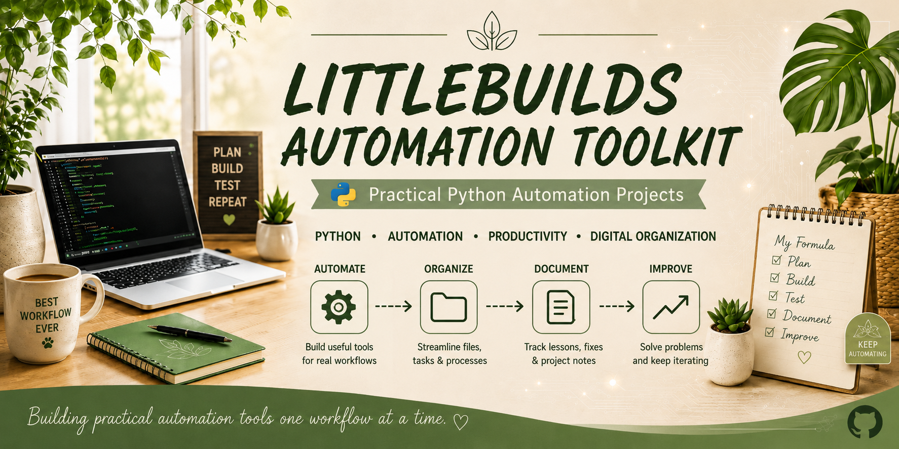

🛠️ Practical Python automation tools for IT, productivity, and digital organization.
---

Welcome!

This repository contains a growing collection of practical Python automation tools created to solve real problems encountered during IT study, homelab management, project documentation, and everyday digital organization.

Rather than building tutorial projects, I wanted to build software that I would actually use.

If a tool exists here, it's because it solved a problem in my own workflow.

---

## 🚀 Current Projects

### 📸 Screenshot Lifecycle Manager

**Status:** 🟢 Active Development — Version 0.2

A Python automation tool built to solve a very real problem in my own workflow: managing the growing number of screenshots created while studying IT, troubleshooting systems, and documenting projects.

Instead of manually digging through hundreds of screenshots, I wanted to build a tool that could help manage their lifecycle from one place.

#### What it can do so far

- 🔎 Scan and report the current screenshot inventory
- 🧭 Provide an interactive command-line menu
- 🧹 Guide screenshot cleanup from the terminal
- 📊 Show useful information before cleanup decisions are made
- 🛡️ Include safeguards to make destructive actions more deliberate
- 📝 Keep development notes and lessons learned documented as the project evolves

#### Where it's going

The long-term goal is to expand the tool beyond cleanup into a more complete screenshot workflow:

**Capture → Organize → Archive → Clean Up**

Every new feature is being added because it solves an actual problem in my workflow rather than simply being added for the sake of the project.

➡️ [View the Screenshot Lifecycle Manager source](./src/screenshot_cleanup/)

📓 [View the development documentation](./docs/)

---

---

## ❤️ Project Philosophy

Every project starts small.

Every feature is earned.

Every mistake is documented.

Every success is celebrated.

The goal isn't to build the biggest automation toolkit.

The goal is to become a better problem solver while creating useful tools along the way.
